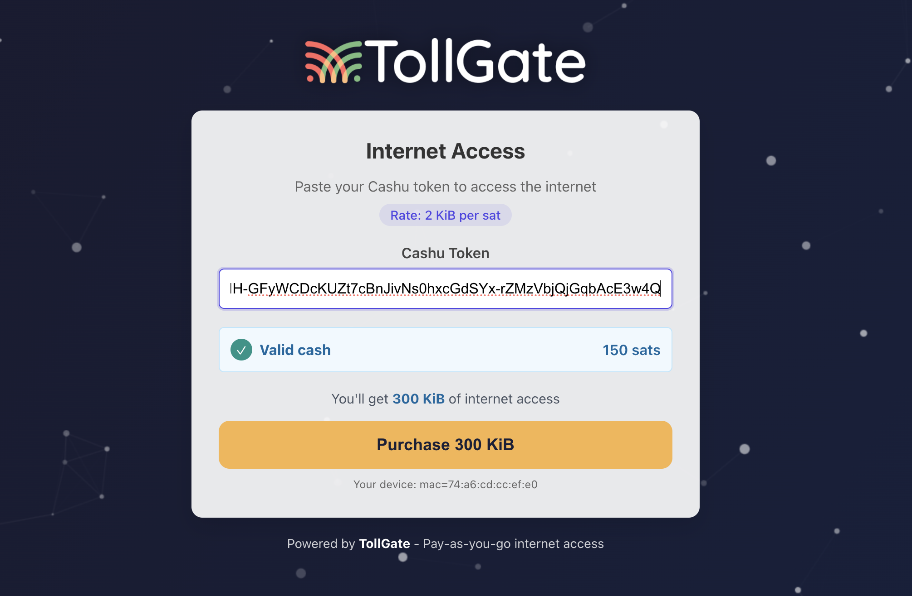

# Tollgate Captive Portal



A captive portal website for [Tollgate](https://tollgate.me) with a light moving background. This portal allows users to paste a Cashu token to gain internet access.

## Features

- Modern UI with animated background
- Input field for Cashu token
- Displays token value upon pasting
- Button to send the token to a Nostr relay
- Responsive design

## Getting Started

### Prerequisites

- Node.js (v14 or later)
- npm (v6 or later)

### Installation

1. Clone the repository
```bash
git clone <repository-url>
cd tollgate-captive-portal-site
```

2. Install dependencies
```bash
npm install
```

3. Start the development server
```bash
npm start
```

The application will be available at http://localhost:3000

### Production Build

To create a production build:

```bash
npm run build
```

The build files will be generated in the `build` directory.

## How It Works

1. The user is presented with a captive portal screen when they try to access the internet
2. The user pastes their Cashu token into the input field
3. The token value is displayed to the user
4. The user clicks the "Send Token" button
5. The token is sent to a Nostr relay at 192.168.1.1:3334 as a kind 21000 event
6. If successful, the user is granted internet access

## Configuration

To configure the Nostr relay address and other settings, modify the relevant variables in the `App.js` file.

## License

This project is licensed under the GPLv3 License. 